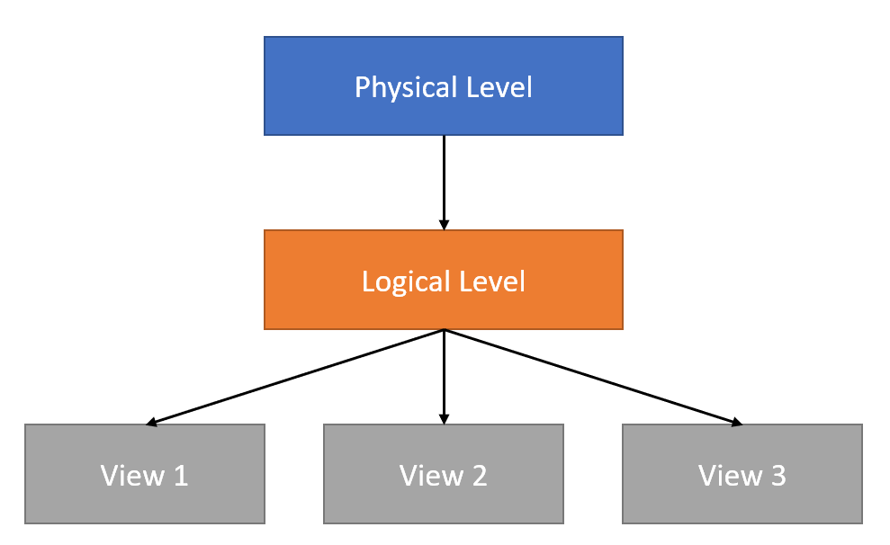

# Table of Contents
- [Characteristics of DBMS](#characteristics-of-dbms)
  * [Data Redundancy](#data-redundancy)
  * [Data Consistency](#data-consistency)
  * [Concurrent Access](#concurrent-access)
  * [Query Language](#query-language)
  * [Security](#security)
  * [Transaction Management](#transaction-management)
- [Data Abstraction](#data-abstraction)
  * [Physical Level](#physical-level)
  * [Logical Level](#logical-level)
  * [View Level](#view-level)
- [Data Independence](#data-independence)
  * [Physical Data Independence](#physical-data-independence)
  * [Logical Data Independence](#logical-data-independence)
- [System Architecture of DBMS](#system-architecture-of-dbms)
  * [1 Tire Architecture](#1-tire-architecture)
  * [2 Tire Architecture](#2-tire-architecture)
  * [3 Tire Architecture](#3-tire-architecture)
- [Roles of Database Administrator (DBA)](#roles-of-database-administrator--dba-)
- [Types of DBMS User](#types-of-dbms-user)
  * [End Users](#end-users)
  * [Application Programmers](#application-programmers)
  * [Sophisticated Users](#sophisticated-users)
  * [Specialized Users](#specialized-users)

# Characteristics of DBMS

- Data bases Stores data into tables contains rows and columns.
- Various tables are tided together with relationship to make data meaningful.
- All Database Management Systems have some characteristics to improve performance, deal with issues like security, validation of data etc.

## Data Redundancy

- Reduce Data Redundancy
- All DBMS provides some mechanism for data redundancy.
- Allows to reduce duplicate data.
- When duplicate data are stored, it may cause various problems like need more hard disk space, data become inconsistent etc.

## Data Consistency

- Data consistency is very important in every DBMS.
- In modern days data is accessed and modified so many times, hence it is important that data is in correct form.
- Most DBMS have some mechanism which can be used for data consistency.

## Concurrent Access

- Allows multiple users to use database and also maintain data consistency.

## Query Language

- Provides a some sort of query language which can be used to read, write and modify data stored in the database.
- Most DBMS system supports query language known as SQL (Standard Query Language).
- SQL is standard query language which is used by most RDMBS.

## Security

- DBMS also provides a way to manage security of data.
- We can create different types of users so each type of user only has particular access to data.
- We can also control the read/write access to the data.

## Transaction Management

- Allow to better manage data integrity by using transaction management

# Data Abstraction

- All Database Management System uses complex data structures to store and retrieve data.
- To make things easier for user, DBMS provides data abstraction, means it provides a way to separate of data accessed by user and how data is actually handled by the DBMS on the file system.
- This concept is known as data abstraction.

There are 3 levels of data abstraction

## Physical Level

- This is lowest level of data abstraction. This actually represents how the data is actually stored on physical medium like hard disk.
- DBMS uses different data structures like stacks, queues, arrays, tree, graphs etc. to store the data.

## Logical Level

- It is middle level (higher level compared to physical level)
- It describe what data is stored in the database and how different relationship between tables.

## View Level

- It is highest level of abstraction.
- Also closest to user.
- Shows the relevant data inform of tables and views.
- Different user can have different view of database according to the rights given to each user.

# Data Independence

- Main purpose of Data Abstraction is to achieve data independence to save time and cost required when data is modified or altered.
- Data Independence can be divided into two categories.
  - Physical Data Independence
  - Logical Data Independence

## Physical Data Independence

- Physical data independence is to modify or alter the physical schema without any alteration of logical schema.
- The term ‘Schema’ refers to how data is structured in the database. We can say it is the blueprint of the data.
- Example of Physical Data Independence.
  - Adding new storage devices to store more data.
  - Modify the data structures used to store the data.
  - Change of operating system
  - Change of storage devices

## Logical Data Independence

- It refers to modifying logical structure of database without affecting external schema or application using the database.
- The view of the data should not be affected by changes of database logical structure.
- It is little hard to implement as when logical structure is change many times view is also gets affected.
- Example of Logical Data Independence
  - Altering table structures
  - Modifying columns datatypes
  - Change relationship among tables.

# System Architecture of DBMS

- Design of the database is depend on its architecture.
- Architecture of DMBS can be seen as single-tire or multi-tier architecture.
- An n-tier architecture divides system into n related but independent modules.
- Generally there are 3 types of architecture used in projects.
  - 1 tire architecture
  - 2 tire architecture
  - 3 tire architecture

## 1 Tire Architecture

- In this type of architecture database is directly accessible to user.
- User can directly access the database and do modifications.
- It provides fastest performance as it works directly on the database.
- Data Security is concern here.
- Difficult for end-user as he/she directly need to work on database, which can be difficult for common users.
- Generally used by developers

## 2 Tire Architecture

- It is a client server architecture.
- User will communicate with application and application then will communicate with the database.
- Unlike 1 tire architecture user can not directly access the database, it access database using some interface of the application.
- It’s more secure as user is not able to directly access the database.
- More user friendly as user only access the application which most of the time provides user friendly GUI to the user.
- Performance is little bit less compared to 1 tire architecture as one more layer is added between user and database.

> 2 Tire Architecture

## 3 Tire Architecture

- In 3 tire architecture, application is separated into 3 logical tires (modules)
  - Presentation tire or User Interface
  - Application tire
  - Database tire

**Presentation Tire**

- In presentation tire is GUI which is offered to the end user, make up of mostly graphical interface, which decides how data is presented to user.
- It does not contain any business logic, it only deals how the data is represented to user.

**Application Tire**

- Also known as logic tire or middle tier.
- Information is sent/collected to/from the presentation layer
- Information is processed using business logic (rules of business is applied)
- It communicate with data tire using API calls.

**Database Tire**

- Data tire or database tire is the tire which as direct access to the database.
- Data tire provides different APIs to manipulate database information. 
- These APIs are used by Application tire to access the database.

> 3 Tire Architecture

# Roles of Database Administrator (DBA)

- **Schema Design**
  - DBA defines the logical schema of the database. Schema refers to the logical structure of database which includes tables’ structures, their relationship, views etc.
  - Schema is designed according to the requirement of the project / organization for example which data needs to be stored.
- **Assisting Application Programmer**
  - DBA provides assistance to the application programmer how data can be accessed or manipulated to develop an application.
- **Data Access**
  - Creates different types of users and set data access rights for each users.
- **Monitor Performance**
  - DBA checks and monitor the performance of the database, and try to achieve best performance.
  - If the performance is sub par then DBA may change logical schema or design to ensure the performance.
- **Backup and Recovery**
  - Database is most important part of any application.
  - Data stored in the database is most important and must not be lost in any situation.
  - DBA periodically takes the back of the database depending on the requirement of the application.
  - In case of failure like hardware failure, virus attack etc. DBA restore/recover the database to ensure smooth operation.

# Types of DBMS User

- Database users are the one who uses the database. Depending on the how user uses the database we can categorized users into multiple categories.
  - End Users
  - Application Programmers
  - Sophisticated Users
  - Specialized Users

## End Users

- Let's say a user wants to transfer some amount from his account to another account.
- He doesn't need to know programming languages or query languages to do this.
- He is a naive user, so he goes to his Internet banking interface which is a previously written program.
- All he has to do is, add the account number from which he wants to transfer the money, add the amount of money he wants to transfer and finally add the account number of the account he wants the money to be transferred to.
- After submission of this information, the program will write the query according to the information provided by the user and execute the query and the money will be transferred.

## Application Programmers

- Application programmers are computer professionals who write application programs.
- Application programmers can choose from many tools to develop user interfaces.
- Rapid application development (RAD) tools are tools that enable an application programmer to construct forms and reports without writing a program.
- Example : adobe Dreamweaver for making forms.

## Sophisticated Users

- Sophisticated users are users who do not use any programs, instead they write the queries themselves in database query language.
- They submit each query to query processor.
- Query processor breaks down each DML query into instructions that can be understood
- E.g. Analyst who submit queries to explore the data in database fall in the category of sophisticated users.
- E.g. Weather Analyst

## Specialized Users

- Specialized users are sophisticated users who write special database applications that do  not fit into traditional data processing framework.
- Examples of special database applications are
- Computer aided design system
- Data storage systems with complex data types like audio data and graphical data, etc.