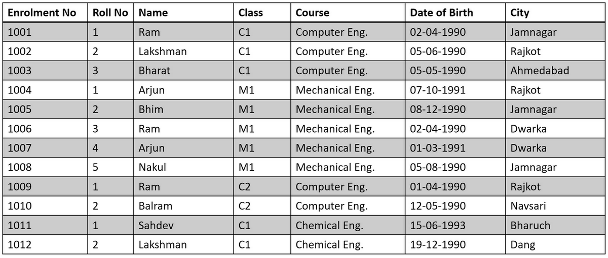
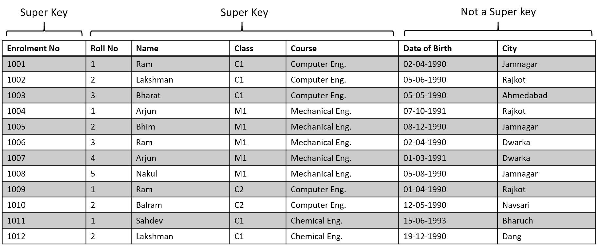
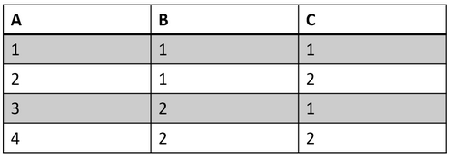
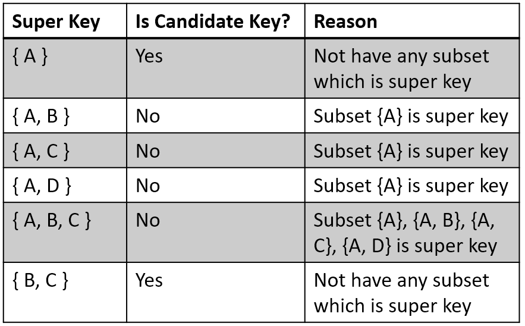
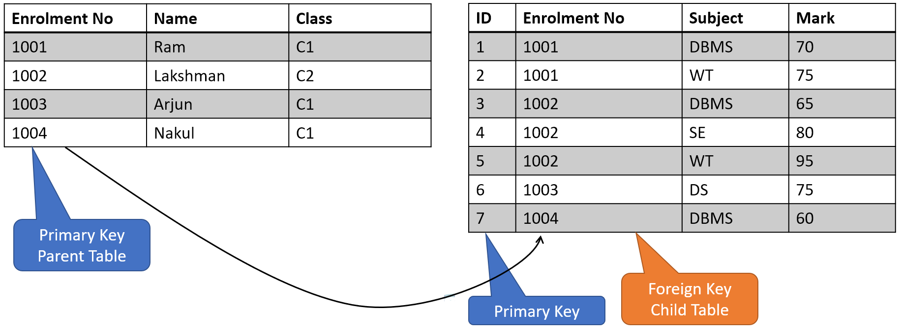

# Table of Contents

- [Keys in DBMS](#keys-in-dbms)
  * [Why Keys are required?](#why-keys-are-required-)
- [Types of Keys](#types-of-keys)
  - [Super Key](#super-key)
  - [Candidate Key](#candidate-key)
  - [Primary Key](#primary-key)
  - [Alternate Key](#alternate-key)
  - [Foreign Key](#foreign-key)
  - [Composite Key](#composite-key)
  - [Unique Key](#unique-key)

# Keys in DBMS

- Key in DBMS is attribute (column) or set of attributes that help to uniquely identify a (tuple) record in a table (relation)
- Keys are also used to establish relationship between different tables of the database.

## Why Keys are required?

- Table is used to store the records.
- In a table there may be thousands of records and there should be a way to identify each record separately and uniquely.
- If we can’t identify each record individually then our data is of no use.

Let’s take an example of students studying in a college. Below is the table where data of student is stored.

> Table 1.1 - Student Detail

As there are so many record in this table, we need to identify each record (student) uniquely, so whenever we want to get information of particular student we can get it easily.

What attribute of student will identify them uniquely? We can say we can identify any student using name, roll no, class, course, etc..

But such attributes can have duplicate values, for example two students can have same name. So we can’t uniquely identify student only by his/her name. So we can use enrolment no to identify each student, as each student has unique enrolment no. So here enrolment no column can be a key in this table.

Or we can also combine multiple attribute to identify the record uniquely We can say combination of (roll no, name, class, course) will be unique and can be used to identify each student. So this combination (roll no, name, class, course) also can be a key in this table.

# Types of Keys

There are main 7 types of keys in DBMS

- Super Key
- Primary Key
- Candidate Key
- Alternate Key
- Foreign Key
- Composite Key
- Unique Key

# Super Key

- Super key is attribute or group of attribute which can be used to identify each tuple (records) of the table uniquely.

- Table can have more than one super key which can be used to identify the each tuple of table uniquely

> Table 1.1 - Student Detail

- For example, in table 1.1
- Enrolment no attribute can be a super key
- (roll no, name, class, course) can be a super key
- (enrolment no, name) can be a super key
- (enrolment no, name, class) can be super key
- But (name, date of birth, city) can not be a key because it can’t identify the records uniquely.
- As we can see, there can be more than one super key in any table.

Maximum how many super key can be possible in a table?

For table with n column, maximum no of super key can be
$$
Max No Of Super Key = 2^𝑛−1
$$
For example table with 3 column: 
$$
MaxNoOfSuperKey = 2^3 -1 = 7
$$

$$
MaxNoOfSuperKey = 7
$$

# Candidate Key

- Candidate key is attribute or group of attributes which is used to identify each record uniquely.
- Candidate key is minimal subset of super keys.
- In other words, any super key is candidate key if its any subset is not a super key. 
- In short Candidate key is a minimal (i.e. irreducible) super key 
- So we can every candidate key is super key, but not every super key is not candidate key.

> Table 1.2 - Sample Table

Table 1.2 has below super keys 

{ A }
{ A, B }
{ A, C }
{ A, B, C }
{ B, C }

But not all above super key is considered as candidate key as we can see in below table. Only {A} and {B, C} is candidate key.

> Table 1.3 Candidate Key

# Primary Key

- Primary key is attribute or group of attributes which is used to identify each record uniquely.
- There can be only one primary key can be in any table.
- Primary key is chosen from the list candidate keys.
- When primary key constraint is assigned to any column or group of column in table below rules are applied.
  - Every record must have value in primary key.
  - Primary key column(s) cannot be null.
  - Value in Primary key column(s) can not be duplicate, means two or more record cannot have same value in primary key column(s)

For example in table 1.3 there are two candidate key {A} and {B, C}. From this 2 candidate key, we can choose any one candidate key as primary key. e.g. {A}

# Alternate Key

- An alternate key is a candidate key that is not chosen by database designer to identify tuples uniquely in a relation.
- In other words, all candidate keys except primary key is called alternate key.

For example in table 1.3 if we choose {A} as primary key then {B, C} will be the candidate key, and if we choose {B, C} as primary key then {A} is called alternate key.

# Foreign Key

- A foreign key is an attribute or collection of attributes in one table that refers to the primary key in another table.
- A table containing the foreign key is called the child table, and the table containing the primary key is called the parent table.
- Also known as Referential Integrity Constraint

# Composite Key

- When two or more attributes of a table are used to identify each record uniquely.
- If key consists of more than one attribute, that key is known as composite key.

# Unique Key

- Unique key is attribute or set of attributes in a table such that
  - Table does not have duplicate value in that unique column or set of columns.
  - Table does not have null value in that unique column or set of columns.