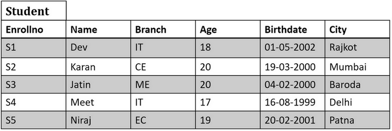

# Table of Contents

- [Relational Algebra](#relational-algebra)
  * [Operations in Relational Algebra](#operations-in-relational-algebra)
- [SELECT (Symbol σ) (Sigma)](#select-(symbol-σ)-(sigma))
- [PROJECT (Symbol Π) (Pi)](#project-(symbol-Π)-(pi))
- [SELECT & PROJECT Combine Operation](#select-&amp;-project-combine-operation)

# Relational Algebra

- Relational Algebra is procedural query language, which takes Relation as input and generate relation as output.
- Relational algebra mainly provides theoretical foundation for relational databases and SQL.
- In relational algebra input is a relation (table) and output is also a relation (table) (temporary table holding the data asked by the user)

## Operations in Relational Algebra

- Unary Relational Operation
  - SELECT (Symbol σ) (Sigma)
  - PROJECT (Symbol ∏) (Pi)
- Operations from set theory
  - UNION (Symbol ∪)
  - INTERSECTION (Symbol ∩)
  - DIFFERENCE (Symbol −)
  - CARTESIAN PRODUCT (Symbol Χ)
- Binary Relational Operation
  - JOIN 
    - Inner Join
    - Left Outer Join
    - Right Outer Join
    - Full Outer Join
  - DIVISION

# SELECT (Symbol σ) (Sigma)

- **Symbol** : σ (SIGMA)

- **Operation:** Display particular tuples from a relation that satisfy a given condition (predicate) 
- **Operators:** =, <>, <, >, <=, >=, ^ (AND), v (OR)

**Example 1:**

- Select all account whose balance is greater then 100000 from relation SavingAaccount

**Example 2**

Below is the relation named 'r'. From relation r select the records where a = b and d > 5. When we use the below Select operation to find the below output relation is generated.

**Exercise**

Above is the relation Student. Find below using Select operation

**Questions**

1. Display the detail of students belongs to “Rajkot” city.
2. Display the details students whose name is Karan
3. Display the details of students who is studying in EC branch
4. Display the details of students who are living in Mumbai and studying in CE branch
5. Display the details of students who are living in Delhi and Patna
6. Display the details of students whose enrolment no is S3 and S5

**Answers**

# PROJECT (Symbol Π) (Pi)

- **Symbol:** Π (Pi)

- **Operation:** Selects specified attributes of a relation.
- Project operation selects certain columns from a table while discarding others.
- It removes any duplicate tuples (records) from the result.
- The result of the project operation has only the attributes specified in the attribute list and in the same order as they appear in list.

**Example 1**

List out all account number and name from SavingAccount relation

**Example 2**

**Exercise**

Above is the relation Student. Find below using Project operation

**Questions**

1. Display the Enrollno, Name and city of all students.
2. Display Enrollno, branch, name of students
3. Display branch, name, city of students
4. Display name, Enrollno, branch of students

**Answers**

# SELECT & PROJECT Combine Operation

We can also combine Select and Project operation as seen in below example.

Display the Enrollno,Name and city of “IT” branch students.

**Output Relation**

