# Table of contents

- [Relational Algebra](#relational-algebra)
  - [Operations in Relational Algebra](#operations-in-relational-algebra)
- [SELECT Operation](#select-operation)
- [PROJECT Operation](#project-operation)
- [Combination of SELECT and PROJECT Operation](#combination-of-select-and-project-operation)
- [UNION Operation](#union-operation)
- [INTERSECTION Operation](#intersection-operation)
- [SET DIFFERENCE Operation](#set-difference-Operation)

# Relational Algebra

- Relational Algebra is procedural query language, which takes Relation as input and generate relation as output.
- Relational algebra mainly provides theoretical foundation for relational databases and SQL.
- In relational algebra input is a relation (table) and output is also a relation (table) (temporary table holding the data asked by the user)

## Operations in Relational Algebra

- Unary Relational Operation
  - SELECT (Symbol σ) (Sigma)
  - PROJECT (Symbol ∏) (Pi)
  
- Binary Relational Operation

  - Operations from set theory
    - UNION (Symbol ∪)
    - INTERSECTION (Symbol ∩)
    - DIFFERENCE (Symbol −)
    - CARTESIAN PRODUCT (Symbol Χ)

  - JOIN 
    - Inner JOIN
    - Left Outer JOIN
    - Right Outer JOIN
    - Full Outer JOIN
  - DIVISION

# SELECT Operation

- **Symbol** : σ (SIGMA)

- **Operation:** Display particular tuples from a relation that satisfy a given condition (predicate) 
- **Operators:** =, <>, <, >, <=, >=, ^ (AND), v (OR)

**Example 1:**

- Select all account whose balance is greater then 100000 from relation SavingAaccount

**Example 2**

Below is the relation named 'r'. From relation r select the records where a = b and d > 5. When we use the below Select operation to find the below output relation is generated.

**Exercise**

Above is the relation Student. Find below using Select operation

**Questions**

1. Display the detail of students belongs to “Rajkot” city.
2. Display the details students whose name is Karan
3. Display the details of students who is studying in EC branch
4. Display the details of students who are living in Mumbai and studying in CE branch
5. Display the details of students who are living in Delhi and Patna
6. Display the details of students whose enrolment no is S3 and S5

**Answers**

# PROJECT Operation

- **Symbol:** Π (Pi)

- **Operation:** Selects specified attributes of a relation.
- Project operation selects certain columns from a table while discarding others.
- It removes any duplicate tuples (records) from the result.
- The result of the project operation has only the attributes specified in the attribute list and in the same order as they appear in list.

**Example 1**

List out all account number and name from SavingAccount relation

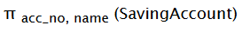

**Example 2**

**Exercise**

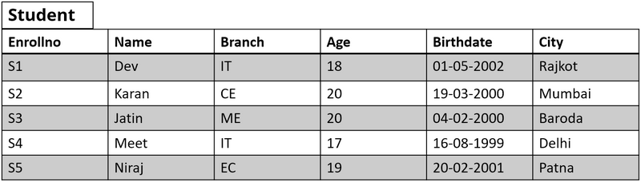

Above is the relation Student. Find below using Project operation

**Questions**

1. Display the Enrollno, Name and city of all students.
2. Display Enrollno, branch, name of students
3. Display branch, name, city of students
4. Display name, Enrollno, branch of students

**Answers**

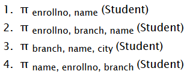

# Combination of SELECT and PROJECT Operation

We can also combine Select and Project operation as seen in below example.

Display the Enrollno,Name and city of “IT” branch students.

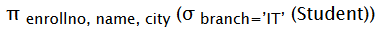

**Output Relation**

# UNION Operation

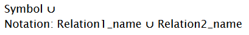

- **Operation:** Operation of Union in relational algebra is same as set theory union operation. It combines the tuples (records) of the both input relation. 
- **Requirement:** Union must be taken between compatible relations
- Relation R and S are compatible, if
  - Both have same number of attributes
  - Domain of the attribute of R and S are similar

**Example 1**

In above example we have two relation named 'r' and 's'. Output of R ∪ S will display all the records of relation r and relation after combining them. If there are some duplicate records it will remove the duplicate records

**Example 2**

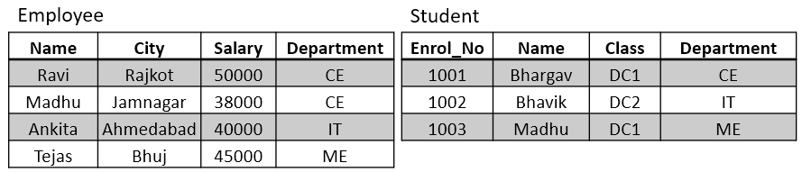

Above are two relation employee and relation that stores the detail of employee and student respectively.

List all the students and faculties with their department.

Here Employee relation and Student relation are not compatible relations. But the resultant relation of projection operator contains similar attribute with similar domain. So it is possible to apply union operation after applying such project operation even though the original relations are not compatible.

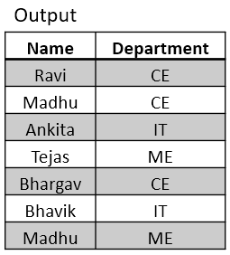

# INTERSECTION Operation

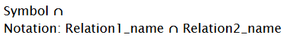

- **Operation:** Selects the tuples (records) which are common in both the input relations.
- **Requirement:** Union must be taken between compatible relations
- Relation R and S are compatible, if
  - Both have same number of attributes
  - Domain of the attribute of R and S are similar

**Example 1**

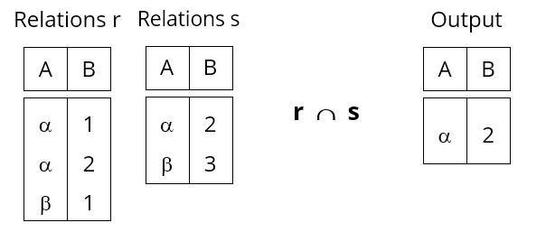

In above example we have two relation named 'r' and 's'. Output of R ∩ S will display only those records which are common in both the relation.

**Example 2**

Above are two relation employee and relation that stores the detail of employee and student respectively.

List all the employee who are also students.

Here Employee relation and Student relation are not compatible relations. But the resultant relation of projection operator contains similar attribute with similar domain. So it is possible to apply intersection operation after applying such project operation even though the original relations are not compatible.

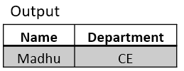

# SET DIFFERENCE Operation

- **Symbol:** - (minus sign)
- **Notation:** Relation1_name - Relation2_name
- **Operation: ** Returns all the records from relation1 (left relation) after removing the common records of relation1 and relation2.

**Example**

Above are two relation employee and relation that stores the detail of employee and student respectively.

List all the employee who are not students.

Here Employee relation and Student relation are not compatible relations. But the resultant relation of projection operator contains similar attribute with similar domain. So it is possible to apply set difference operation after applying such project operation even though the original relations are not compatible.

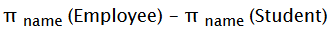

