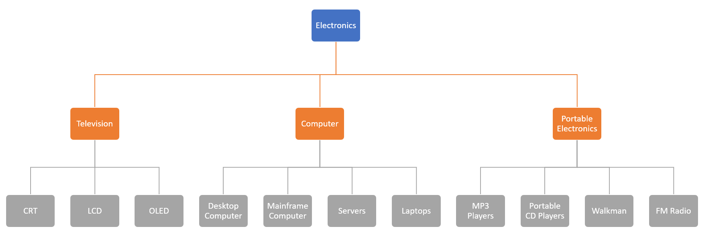
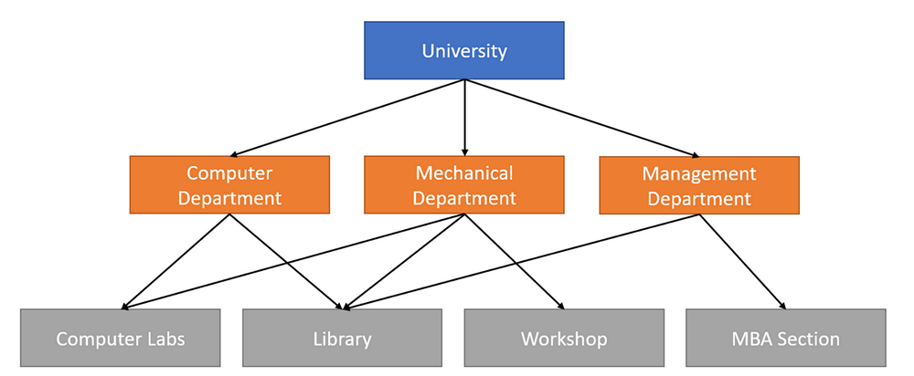
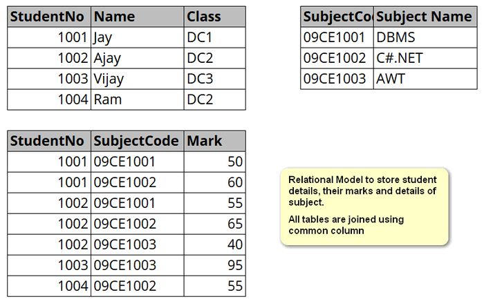
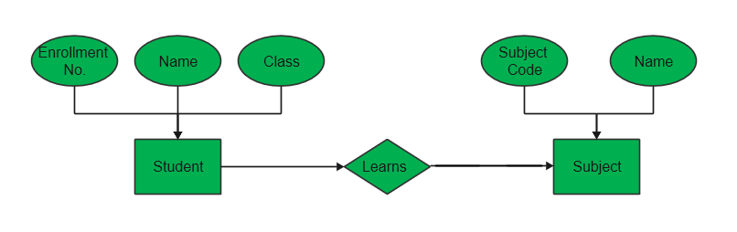
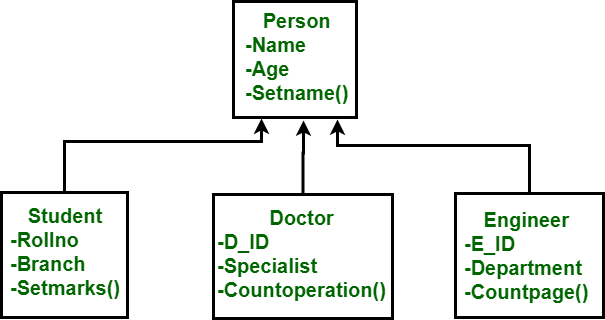

# Table of Contents

- [What is Data model?](#what-is-data-model-)
  * [Type of Data models](#type-of-data-models)
- [Hierarchical model](#hierarchical-model)
- [Network Model](#network-model)
- [Relational model](#relational-model)
- [Entity Relationship Model](#entity-relationship-model)
- [Object Oriented Database model](#object-oriented-database-model)
- [NoSQL Database model](#nosql-database-model)

# What is Data model?

- Database data model defines the logical structure of the database.
- Various data models are used to define the structure of the database when designing a database.
- It defines how the data will be organized and accessed.
- Conceptual tool to describe a database design.
- Shows the logical structure, relationships, constraints which decides how data will be stored and accessed.
- Most data models can be represent using a accompanying database diagram in UML.

## Type of Data models

- Early Models
  - Hierarchical model
  - Network model
  - Relational model
- Entity Relationship Model
- Object-oriented database model
- NoSQL model

# Hierarchical model

- Organize the data in tree like structure.
- Where each record has single parent or root.
- Siblings are sorted in a particular order.
- Useful to represent real life relationships.
- This model was mostly used in IBM’s Information Management System in early 60s and 70s.
- This model is not used much in present day.

> Hierarchical model

# Network Model

- Build on the top of Hierarchical model.
- Allows many to many relationship.
- In Hierarchical model any record only can have a single parent, but in Network model record can have multiple parents.
- Hence it allows complex relationships. 

> Network Model

# Relational model

- Most common model
- Arrange the data into tables.
- Each tables consists of rows and columns.
- Columns represents attributes.
  - E.g. name, address, zip code, country etc.
- Rows represent a record. Rows also known as tuple.
- Tables are joined together using some common column.
- Most used model in current time.
- This type of database generally uses SQL (Structured Query Language) to read/write the data.

> Relational Model

# Entity Relationship Model

- In this model, it captures the relationship between object that represents the real world object known as entity.
- It defines how different entities are related to each other.
- After defining entities, attributes of each entity is defines.
- Attributes represents the data about the entity.
  - E.g. name, enrolment no, salary, address, organization etc.
- Generally relational data model is constructed from the ER Model.
- In ER model entity is represented using rectangle, attributes are represented using ellipse and relationships are represented using Dimond shape.

> Entity Relationship Model (E R Model)

# Object Oriented Database model

- Object Oriented Database model defines a database as a collection of objects, and reusable component like we use in object oriented programming.
- This model is used to solve the need of complex data storage.
- In object oriented data model both data and their relationship are contained in a single structure known as object.
- In Object Oriented Data Model, data and their relationships are contained in a single structure which is referred as object in this data model. 
- In this, real world problems are represented as objects with different attributes. 
- All objects have multiple relationships between them.

> Object Oriented Data Model. 
>
> Image Source: https://www.geeksforgeeks.org/basic-object-oriented-data-model

# NoSQL Database model

- NoSQL (Also known as not only SQL) database model uses non tabular approach and store data differently compared to relational model.
- NoSQL database model stores the data in many different ways like document, key-value pairs, graphs, wide-column etc.
- It provides flexible schema which can be scaled easily with large amount of data.
- Firebase, MongoDB are examples of NoSQL database model.

