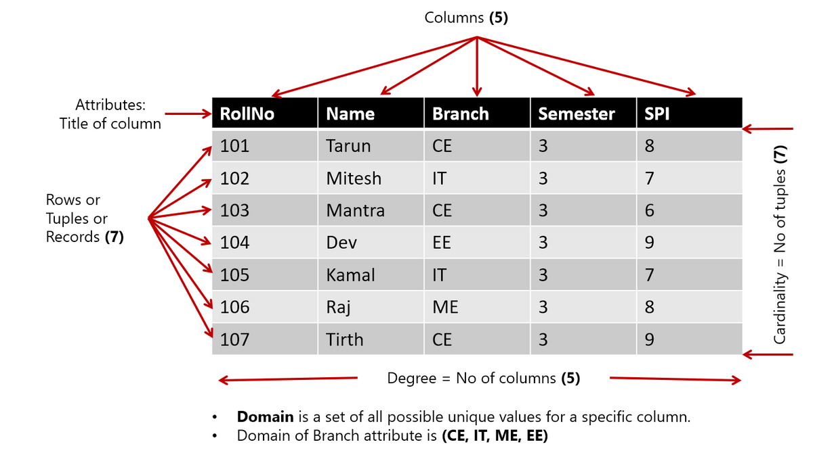

# Table of Contents

- [Structure of Relational Database](#structure-of-relational-database)

# Structure of Relational Database

- A database consists of a collection of tables (relations), each having a unique name.
- **Table (Relation):** A database object that holds a collection of data for a specific topic. Table consist of rows and columns.
- **Column (Attribute):** The vertical component of a table. A column has a name and a particular data type; e.g. varchar, decimal, integer, datetime etc.
- **Row (Record / Tuple):** The horizontal component of a table, consisting of a sequence of values, one for each column of the table. It is also known as row / record / tuple.
- **Cardinality:** Number of row in any table is called Cardinality. For example, in above table cardinality is 7
- **Domain:** Domain is set of possible unique value in any particular column. For example, in above table, domain of branch attribute is (CE, IT, ME, EE)
