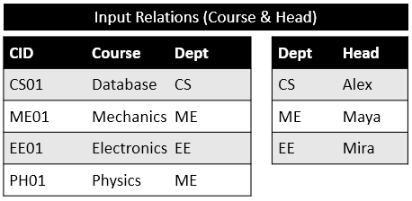
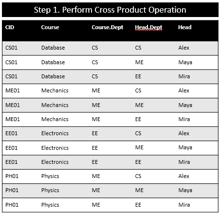
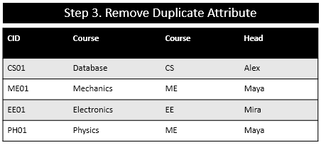
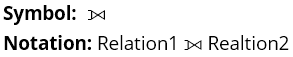
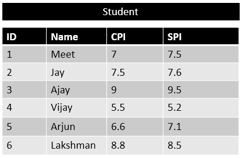

# Table of contents

- [Relational Algebra](#relational-algebra)
  * [Operations in Relational Algebra](#operations-in-relational-algebra)
- [SELECT Operation](#select-operation)
- [PROJECT Operation](#project-operation)
- [Combination of SELECT and PROJECT Operation](#combination-of-select-and-project-operation)
- [UNION Operation](#union-operation)
- [INTERSECTION Operation](#intersection-operation)
- [SET DIFFERENCE Operation](#set-difference-operation)
- [CROSS PRODUCT Operation](#cross-product-operation)
- [Join](#join)
  - [Natural Join - Inner Join](#natural-join---inner-join)
  - [Left Outer Join](#left-outer-join)
  - [Right Outer Join](#right-outer-join)
  - [Full Outer Join](#full-outer-join)
- [Relational Calculus](#relational-calculus)
  * [Tuple Relational Calculus](#tuple-relational-calculus)
  * [Domain Relational Calculus](#domain-relational-calculus)
- [Aggregate Functions](#aggregate-functions)
  * [Sum](#sum)
  * [Max](#max)
  * [Min](#min)
  * [Avg](#avg)
  * [Count](#count)

# Relational Algebra

- Relational Algebra is procedural query language, which takes Relation as input and generate relation as output.
- Relational algebra mainly provides theoretical foundation for relational databases and SQL.
- In relational algebra input is a relation (table) and output is also a relation (table) (temporary table holding the data asked by the user)

## Operations in Relational Algebra

- Unary Relational Operation
  - SELECT (Symbol σ) (Sigma)
  - PROJECT (Symbol ∏) (Pi)
  
- Binary Relational Operation

  - Operations from set theory
    - UNION (Symbol ∪)
    - INTERSECTION (Symbol ∩)
    - DIFFERENCE (Symbol −)
    - CARTESIAN PRODUCT (Symbol Χ)

  - JOIN 
    - Inner JOIN
    - Left Outer JOIN
    - Right Outer JOIN
    - Full Outer JOIN
  - DIVISION

# SELECT Operation

- **Symbol** : σ (SIGMA)

- **Operation:** Display particular tuples from a relation that satisfy a given condition (predicate) 
- **Operators:** =, <>, <, >, <=, >=, ^ (AND), v (OR)

**Example 1:**

- Select all account whose balance is greater then 100000 from relation SavingAaccount

**Example 2**

Below is the relation named 'r'. From relation r select the records where a = b and d > 5. When we use the below Select operation to find the below output relation is generated.

**Exercise**

Above is the relation Student. Find below using Select operation

**Questions**

1. Display the detail of students belongs to “Rajkot” city.
2. Display the details students whose name is Karan
3. Display the details of students who is studying in EC branch
4. Display the details of students who are living in Mumbai and studying in CE branch
5. Display the details of students who are living in Delhi and Patna
6. Display the details of students whose enrolment no is S3 and S5

**Answers**

# PROJECT Operation

- **Symbol:** Π (Pi)

- **Operation:** Selects specified attributes of a relation.
- Project operation selects certain columns from a table while discarding others.
- It removes any duplicate tuples (records) from the result.
- The result of the project operation has only the attributes specified in the attribute list and in the same order as they appear in list.

**Example 1**

List out all account number and name from SavingAccount relation

**Example 2**

**Exercise**

Above is the relation Student. Find below using Project operation

**Questions**

1. Display the Enrollno, Name and city of all students.
2. Display Enrollno, branch, name of students
3. Display branch, name, city of students
4. Display name, Enrollno, branch of students

**Answers**

# Combination of SELECT and PROJECT Operation

We can also combine Select and Project operation as seen in below example.

Display the Enrollno,Name and city of “IT” branch students.

**Output Relation**

# UNION Operation

- **Operation:** Operation of Union in relational algebra is same as set theory union operation. It combines the tuples (records) of the both input relation. 
- **Requirement:** Union must be taken between compatible relations
- Relation R and S are compatible, if
  - Both have same number of attributes
  - Domain of the attribute of R and S are similar

**Example 1**

In above example we have two relation named 'r' and 's'. Output of R ∪ S will display all the records of relation r and relation after combining them. If there are some duplicate records it will remove the duplicate records

**Example 2**

Above are two relation employee and relation that stores the detail of employee and student respectively.

List all the students and faculties with their department.

Here Employee relation and Student relation are not compatible relations. But the resultant relation of projection operator contains similar attribute with similar domain. So it is possible to apply union operation after applying such project operation even though the original relations are not compatible.

# INTERSECTION Operation

- **Operation:** Selects the tuples (records) which are common in both the input relations.
- **Requirement:** Union must be taken between compatible relations
- Relation R and S are compatible, if
  - Both have same number of attributes
  - Domain of the attribute of R and S are similar

**Example 1**

In above example we have two relation named 'r' and 's'. Output of R ∩ S will display only those records which are common in both the relation.

**Example 2**

Above are two relation employee and relation that stores the detail of employee and student respectively.

List all the employee who are also students.

Here Employee relation and Student relation are not compatible relations. But the resultant relation of projection operator contains similar attribute with similar domain. So it is possible to apply intersection operation after applying such project operation even though the original relations are not compatible.

# SET DIFFERENCE Operation

- **Symbol:** - (minus sign)
- **Notation:** Relation1_name - Relation2_name
- **Operation: ** Returns all the records from relation1 (left relation) after removing the common records of relation1 and relation2.

**Example**

Above are two relation employee and relation that stores the detail of employee and student respectively.

List all the employee who are not students.

Here Employee relation and Student relation are not compatible relations. But the resultant relation of projection operator contains similar attribute with similar domain. So it is possible to apply set difference operation after applying such project operation even though the original relations are not compatible.

# CROSS PRODUCT Operation

CROSS PRODUCT Operation is also known as CARTESIAN PRODUCT Operation

- **Symbol:** X (Cross)
- **Notation:** Relation1_name  X Relation2_name
- **Operation:** Combines information of two relations, It is also known as Cross-Product operation and similar to mathematical Cartesian Product Operation
- **Result:** for Relation1 and Relation2 if they have n1 and n2 attributes respectively then resultant relation will have n1+n2 attributes, combining attributes from both the input relations 
- If both relation have same name of attributes then they are distinguished using following notation.
  - Relation_Name.Attribute_Name
  - i.e. Relation1.n1 or Relation2.n1
- If Relation1 has t1 tuples and Relation2 has t2 tuples then the resultant relation will have t1 * t2 tuples, combining each possible pair of tuples from both the relations.
- In Short we can say,
- Attributes of Resultant Relation =  Attributes of R1 + Attributes of R2
- Tuples of Resultant Relation = Tuples of R1 * Tuples of R2

**Example**

Above are two relation. Student relation have three attributes roll no, name and branch and two records. Result relation have two attribute roll no and SPI and two records. 

- When we cross product these two relations 
- The resultant relation will have total five attribute (Attributes of Student + Attributes of Result)
- And will have total 4 records. (Records of Student x Records of Result) (Every records of student relation are matched with every records of the result relation.)

**Output Relation**

In above example both relation have same attribute RollNo so it is distinguished by notation Relation_name.Attribute_Name (i.e. Student.RollNo and Result.RollNo)

# Join

In Cross Product every records of left table are matched with every records of the right table. In cross product many records are inconsistent or the data is not correct.

To get the consistent and correct data we can use join.

There are four types of join

- Natural Join (Inner Join)
- Left Outer Join
- Right Outer Join
- Full Outer Join

# Natural Join - Inner Join

**Operation:** Natural join will retrieve consistent data from multiple relations. It combines records from different relations that satisfy a given condition. To perform a natural join there must be one common attribute (column) between two relations.
| Step     | Operation|
|-----|-----|
| Step 1 | It performs Cartesian Product                           |
| Step 2 | Then it deletes inconsistent tuples                     |
| Step 3 | Then it removes an attribute from  duplicate attributes |

**Example 1** 

When we perform natural Join

**Example 2**

When we perform natural Join

# Left Outer Join

In inner join, only the data which have matching records on either side is displayed. If some records do not have matching records the it will be ommited.

To view the records even if there is no matching records on other table we can use left or right outer join.

- **Use:** Combine multiple relation using some common attribute and  also display all the tuples of the left relation even through there is no matching tuple in the right relation. 
- If there are tuples in Left relation without any  matching tuple in the Right relation, then the Right  relation attributes of the resulting relation are treated as NULL.

**Example**

When we perform left outer join on above relations (tables)

# Right Outer Join

- **Use:** Combine multiple relation using some common attribute and  also display all the tuples of the right relation even through there is no matching tuple in the left relation. 
- If there are tuples in right relation without any  matching tuple in the left relation, then the left  relation attributes of the resulting relation are treated as NULL.

**Example**

When we perform right outer join on above relations (tables)

# Full Outer Join

- **Use:** Display all the records from both relation even if there is no matching records on the either side.
- If no matching records found on either side then NULL value is used for such records.
- Basically full outer join = left outer join + right outer join.

**Example**

**Output of Full Outer join**

# Relational Calculus

- Like relational algebra relational calculus is an abstract database language
- Relational calculus and relational algebra can achieve same results.
- In relational calculus queries are described as { | } with desired properties.
- There are two flavours of relational calculus
  - Tuple
  - Domain

## Tuple Relational Calculus

- The tuple relational calculus is specified to select the tuples in a relation.
- {t | P (t)}   or {t | condition (t)} -- this is also known as expression of relational calculus
- Where t is the resulting tuples, P(t) is the condition used to fetch t.

**Example 1**

- {t | EMPLOYEE (t) and t.SALARY>10000}  
- Reads as “set of all t such that t is an element of the relation EMPLOYEE and the SALARY attribute has value greater than 10000”
- Implies that it selects the tuples from EMPLOYEE relation such that resulting employee tuples will have salary greater than 10000. It is example of selecting a range of values.

**Example 2**

- {t | EMPLOYEE (t) AND t.DEPT_ID = 10} 
- this select all the tuples of employee name who work for Department 10.  

- The variable which is used in the condition is called tuple variable. 
- In above example t.SALARY and t.DEPT_ID are tuple variables. 

## Domain Relational Calculus

- In domain relational calculus, filtering variable uses the domain of attributes.
- Domain relational calculus uses the same operators as tuple calculus. It uses logical connectives  Λ (AND), V (OR) and ! (not).
- { a1, a2, a3, ..., an | P (a1, a2, a3, ... ,an)}
- Where a1, a2 are attributesP stands for formula (condition) built by inner attributes

**Example**

- {< name, age > | < name, age > Є Student Λ age > 17}
- Again, the above query will return the names and ages of the students in the table Student who are older than 17.

# Aggregate Functions

- **Use:** It takes collection of values as input and returns a single value as output.
- E.g. Sum, max, min, avg, count

## Sum

It finds the sum of values in particular column.

**Example**

Find the sum of the salary of all employees

## Max

It is used to find the maximum value in particular column

**Example**

Find the Maximum CPI and SPI from Student table.

## Min

It is used to find the minimum value in particular column

**Example**

Find the Minimum CPI and SPI from Student table.

## Avg

It is used to find the average value of particular column

**Example**

Find the Average CPI and SPI from Student table.

## Count

It is used to count the rows or number of values in particular column. 

> Note it only counts the values, if the column has NULL value it is not counted.

**Example**

Find the number of Students

Here count(*) will always give the number of rows in a table.

count(column_name) will give the number of values in that particular row. If column has NULL values its value will be less than count(*) as NULL values are not counted.
