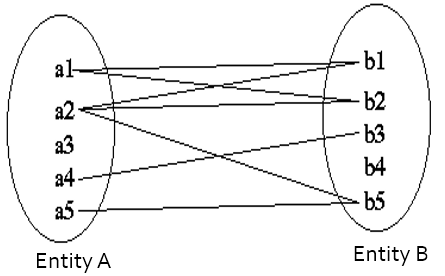

# Entity Relationship Diagram

- Stands for Entity-Relationship diagram.
- It is a graphical or a pictorial representation of a database.
- It uses different types of symbols to represent various instances of database

# Entity and Attributes

- An entity is generally a “thing” or “object” of real world which is present in the context.
- For example, each Employee in a firm is an entity.
- Each entity has various attributes.
- Attributes is used to define the different type of data of the particular entity. (in short attributes defines the detail of entity)
- For example, employee entity can have attributes like name, salary, organization, department etc.
- Each entity in ER Diagram is represented using rectangle shape with name of entity written on the rectangle.

- Attributes of entity are represented using oval/ellipse symbol.
- Attributes are connected with entity using a line.

## Types of Attributes

Attributes of entity can be categorized into several types.

### Simple - Single Value Attribute

All simple attribute which contains a single value is known as a simple or single value attribute.

e.g. Enrolment no, gender etc.

### Composite Attribute

Attribute which can be further divided into sub attribute are known as composite attribute.

e.g. name attribute can be divided into sub attribute like first name, middle name, last name.

e.g. Address attribute can be divided into sub attribute like apartment name, street address, city, pin code

Hence this type of attributes are known as composite attribute. Sub attributes of composite attribute are connected with attribute using a line.

### Multivalued Attribute

Attribute which may have more than one value are known as multivalued attribute. 

E.g. Mobile No, Phone No can have multiple value, as person can have more than one mobile or phone number.

Multivalued attribute are represented using double line oval.

### Derived Attribute

Attribute whose value can be derived from another attributes are known as derived attribute.

E.g. Value of Age attribute can be derived from Date of Birth attribute, so age is known as derived attribute.

Derived attributes are represented using dotted line oval.

### Example of Entity and its attributes.

Above example demonstrate the entity employee which have five attributes named employee code, mobile no, name, date of birth and age.

Here employee code is used for uniquely identify the records of employee so it is written with underline to indicate it is a primary key attribute.

Mobile no is multivalued attribute.

Name is composite attribute containing sub attributed named first name, middle name and last name.

Date of birth is simple / single attribute.

Age is derived attribute, because it can be derived from date of birth attribute.

# Relationship between entities

- Relationship is link between several entities.
- It must be placed between two entities and a line linking it to an entity.
- A relationship is represented by a diamond containing relationship details.
- A Relationship between 2 Entities is called Binary Relationship and A Relationship between 3 Entities is called Ternary Relationship.
- Relationship are represented using Dimond symbol.

**Example**

# Mapping Cardinalities

- It defined number of entities of one entity set connected to number of entities of another entity set using a relationship set.

- Mapping cardinalities are most useful in describing binary relationship sets.
- There are four types of cardinalities.
  - One to One
  - One to Many
  - Many to One
  - Many to Many

## One to One

In one to one mapping, each data of entity A can be associated with at most one data of entity B. And each data of entity B can be associated with at most one data of entity A.

**Example**

Here each student data only can be associated with one data in result entity, and also each result data can be associated with only one data in student entity as each student can only have one result, and each result can be of only one student.

One to one mapping is represented with arrow on both side when representing relationship.

## One to Many

In one to many mapping, each data of entity A can be associated with zero, one or more data of entity B. And each data of entity B can be associated with at most one data of entity A.

**Example**

Hear each customer can take multiple loans, so each customer data can be associated with multiple loan data in the loan entity. But each loan can be only taken by one customer only. So each data on loan entity can be only associated with only one customer data in the customer entity.

One to many mapping is represented with arrow on one side and simple line on many side when representing relationship.

## Many to One

It is reverse of one to many cardinality. In many to one mapping, each data of entity A can be associated with at most one data of entity B. And each data of entity B can be associated with zero, one or more data of entity A.

**Example**

Here each loan can only be taken by one customer only, so each data of loan entity can only be associated with at most one data of customer entity. But each customer can take multiple loans, so each customer data can be associated with multiple loan data in the loan entity.

Many to one mapping is represented with simple line on many side and arrow symbol on one side when representing relationship.

## Many to Many

In many to many cardinality, each data of entity A can be associated with zero, one or more data on the entity B, and also each data of entity B can be associated with zero, one or more data on entity A.

**Example**

Here each student can studies in multiple classroom, so each data of student can be mapped to multiple data on classroom entity. And also each classroom can be allocated to different students, so each data of classroom also can be associated with multiple student data of student entity.

Many to many mapping is represented with simple lines on both side when representing relationship.