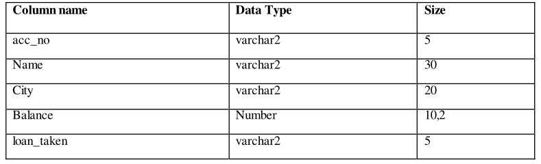
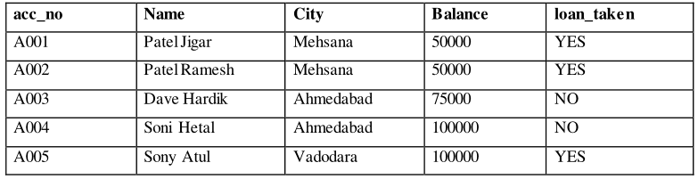
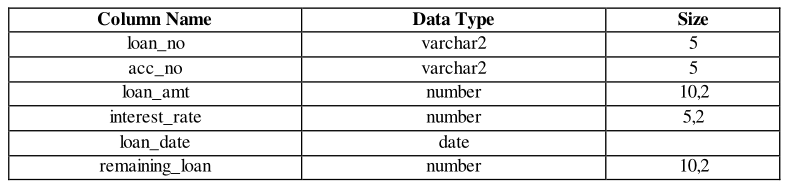
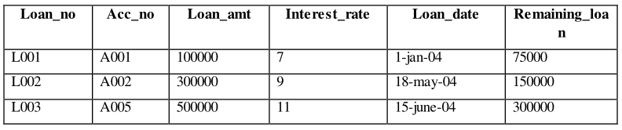
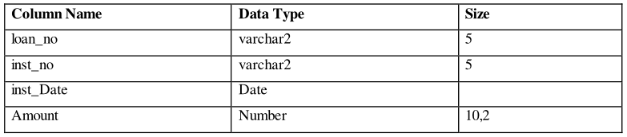
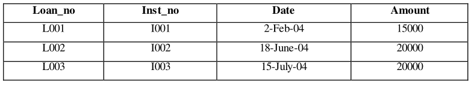
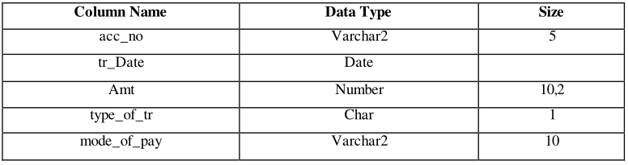
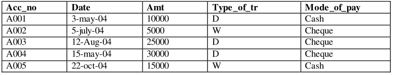

# Practical 1

**Create a table ACCOUNT**



**Solution**

```sql
create table account
(
    acc_no varchar2(5),
    name varchar2(30),
    city varchar2(20),
    balance number (10,2),
    loan_taken varchar2(5)
)
```

**Insert the following records into table account**



**Solution**

```sql
insert into account (acc_no, name, city, balance, loan_taken) values ('A001', 'Patel Jigar', 'Mehsana', '50000', 'YES')
insert into account (acc_no, name, city, balance, loan_taken) values ('A002', 'Patel Ramesh', 'Mehsana', '50000', 'YES')
insert into account (acc_no, name, city, balance, loan_taken) values ('A003', 'Dave Hardik', 'Ahmedabad', '50000', 'NO')
insert into account (acc_no, name, city, balance, loan_taken) values ('A004', 'Soni Hetal', 'Ahmedabad', '50000', 'NO')
insert into account (acc_no, name, city, balance, loan_taken) values ('A005', 'Sony Atul', 'Vadodara', '50000', 'YES')
```

**Create a Table LOAN**



**Solution**

```sql
create table loan
(
    loan_no varchar2(5),
    acc_no varchar2(5),
    loan_amt number(10,2),
    interest_rate number(5,2),
    loan_date date,
    remaining_loan number (20,2)
)
```

**Insert the following records into table loan**



**Solution**

```sql
insert into loan (loan_no, acc_no, loan_amt, interest_rate, loan_date, remaining_loan) values ('L001', 'A001', '100000', '7', '01-01-2004', '75000')
insert into loan (loan_no, acc_no, loan_amt, interest_rate, loan_date, remaining_loan) values ('L002', 'A002', '300000', '9', '05-18-2004', '150000')
insert into loan (loan_no, acc_no, loan_amt, interest_rate, loan_date, remaining_loan) values ('L003', 'A005', '500000', '1', '06-15-2004', '300000')
```

**Create a table INSTALLMENT**



```sql
create table installment
(
	loan_no varchar2(5),
	inst_no varchar2(5),
    inst_date date,
    amount number (10,2)
)
```

**Insert the following records into table installment**



```sql
insert into installment (loan_no, inst_no, inst_date, amount) values ('L001', 'I001', '02-02-2004', '15000')
insert into installment (loan_no, inst_no, inst_date, amount) values ('L002', 'I002', '06-18-2004', '20000')
insert into installment (loan_no, inst_no, inst_date, amount) values ('L003', 'I003', '07-15-2004', '20000')
```

**Create a Table TRANSACTION**



```sql
create table transaction
(
    acc_no varchar2(5),
    tr_date date,
    amt number(10,2),
    type_of_tr char(1),
    mode_of_pay varchar2(10)
)
```

**Insert the following records into table transaction**



```sql
insert into transaction (acc_no, tr_date, amt, type_of_tr, mode_of_pay) values ('A001', '03-03-2004', '10000', 'D', 'Cash')
insert into transaction (acc_no, tr_date, amt, type_of_tr, mode_of_pay) values ('A002', '07-05-2004', '5000', 'W', 'Cheque')
insert into transaction (acc_no, tr_date, amt, type_of_tr, mode_of_pay) values ('A003', '08-12-2004', '25000', 'D', 'Cheque')
insert into transaction (acc_no, tr_date, amt, type_of_tr, mode_of_pay) values ('A004', '05-15-2004', '30000', 'D', 'Cheque')
insert into transaction (acc_no, tr_date, amt, type_of_tr, mode_of_pay) values ('A005', '10-22-2004', '15000', 'W', 'Cash')
```

