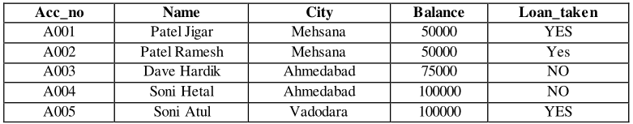
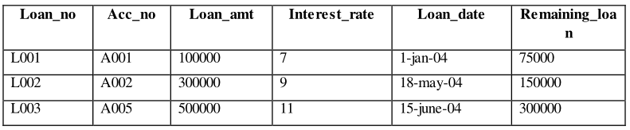
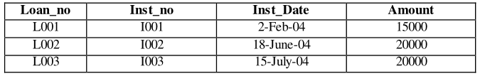
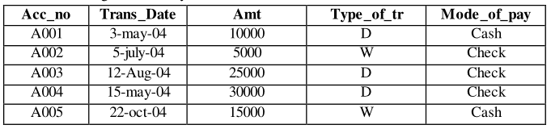

# Queries of Account Table

1.  Insert the following records if you have not inserted in PRACTIAL - 1



```sql
insert into account (acc_no, name, city, balance, loan_taken) values ('A001', 'Patel Jigar', 'Mehsana', '50000', 'YES')
insert into account (acc_no, name, city, balance, loan_taken) values ('A002', 'Patel Ramesh', 'Mehsana', '50000', 'YES')
insert into account (acc_no, name, city, balance, loan_taken) values ('A003', 'Dave Hardik', 'Ahmedabad', '50000', 'NO')
insert into account (acc_no, name, city, balance, loan_taken) values ('A004', 'Soni Hetal', 'Ahmedabad', '50000', 'NO')
insert into account (acc_no, name, city, balance, loan_taken) values ('A005', 'Sony Atul', 'Vadodara', '50000', 'YES')
```

2. Change the name ‘patel jigar’ to ‘patel hiren’.

```sql
update account set name = 'patel hiren' where acc_no = 'A001'
```

3. Change the name and city where account number is A005. (new name = ‘kothari nehal’ and new city = ‘patan’).
```sql
update account set name = 'kothari nehal', city = 'patan' where acc_no = 'A005'
```

4. 1. Display only those records where loan taken status is ‘YES’.

```sql
select * from account where loan_taken = 'Yes'
```

4. 2. Add the new column (address varchar2 (20)) into table ACCOUNT.

```sql
alter table account
add address varchar2(20)
```

5. Create another table ACCOUNT_TEMP (acc_no, name, balance) from table ACCOUNT.

```sql
create table account_temp as select acc_no, name, balance from account
```

6. Rename the table ACCOUNT to ACCOUNT_MASTER.

```sql
alter table account rename to account_master
```

7. Update the column balance for all the account holders.
   --(Multiply the balance by 2 for each account holders)

```sql
update account set balance = balance * 2
```

8. Describe the structure of table ACCOUNT.

```sql
desc account
```

9. Delete the records whose account no is A004.

```sql
delete from account where acc_no = 'A004'
```

---

# Queries of Loan Table

1. Insert the following Records if you have not inserted in PRACTICAL-1



2. for each loan holders Add 100000 Rs. Amount into the column loan_amt.

```sql
update loan set loan_amt = loan_amt + 100000
```

3. for each loan holders Increase the interest rate 2%.

```sql
update loan set interest_rate = interest_rate + 2
```

4. Create another table LOAN_TEMP (loan_no, Acc_no, loan_amt, loan_date) from the table LOAN

```sql
create table loan_temp as select loan_no, Acc_no, loan_amt, loan_date from loan
```

5. Display only those records where loan holder taken a loan in month of January.

```sql
select * from loan where loan_date >= '01-01-2004' and loan_date <= '01-31-2004'

select * from loan where to_char('mm', loan_date) = '01'
```

6. Modify the structure of table LOAN by adding one column credit_no varchar2 (4).

```sql
alter table loan
add credit_no varchar2(4)
```

7. Display the Loan amount*2 of table LOAN.

```sql
select loan_amt*2 from loan
```

8. Display the records of table LOAN by date wise in ascending order.

```sql
select * from loan order by loan_date
```

9. Display the records of table LOAN by account number wise in descending Order.

```sql
select * from loan order by acc_no desc
```

10. Increase the size 5 to 7 of column acc_no.

```sql
alter table loan
modify acc_no varchar2(7)
```

---

# Queries of Installment Table

1. Insert following Records if you have not inserted in PRACTICAL-1

   

2. Change the Inst_Date ‘2-Feb-04’ to ’3-Mar-04’.
```sql
update installment set inst_date = '03-03-2004' where inst_date = '02-02-2004'
```

3. Reduce 5000 amount from all Installment holders.
```sql
update installment set amount = amount - '5000'
```

4. Add the amount 5000 where loan no is ‘L003’ and ‘L002’.
```sql
update installment set amount = amount + '5000' where loan_no = 'L003' or loan_no = 'L002'
```

5. Change the column size of 5 to 7 where column name is Loan_no.
```sql
alter table installment modify loan_no varchar2(7)
```

6. Decrease the column size 5 to 4 where column name Inst_no.
```sql
alter table installment modify inst_no varchar2(4)
```

7. Show the structure of the Table.
```sql
desc installment
```

8. Change the amount 15000 to 5000 where loan number is L001
```sql
update installment set amount = '5000' where loan_no = 'L001'
```

9. Perform delete operation. (Delete only particular one record)
```sql
delete from installment where loan_no = 'L002'
```


# Queries of Transaction Table

1. Insert a Following Records if you have not inserted in PRACTICAL-1



```
insert into transaction (acc_no, tr_date, amt, type_of_tr, mode_of_pay) values ('A001', '03-03-2004', '10000', 'D', 'Cash')
insert into transaction (acc_no, tr_date, amt, type_of_tr, mode_of_pay) values ('A002', '07-05-2004', '5000', 'W', 'Cheque')
insert into transaction (acc_no, tr_date, amt, type_of_tr, mode_of_pay) values ('A003', '08-12-2004', '25000', 'D', 'Cheque')
insert into transaction (acc_no, tr_date, amt, type_of_tr, mode_of_pay) values ('A004', '05-15-2004', '30000', 'D', 'Cheque')
insert into transaction (acc_no, tr_date, amt, type_of_tr, mode_of_pay) values ('A005', '10-22-2004', '15000', 'W', 'Cash')
```

2. Insert any duplicate value and display all the records without any duplicate rows.
```sql
select distinct * from transaction
```

3. Select all the records in descending order(account number wise).
```sql
select * from transaction order by acc_no desc
```
4. Display amt, date, and type of transaction by date wise.
```sql
select amt, tr_date, type_of_tr from transaction order by tr_date
```
5. Create another table TRANSACTION_TEMP from this table.
```sql
create table transaction_temp as select * from transaction
```
6. Create another table TRANS_TEMP by change the column name acc_no to account_no.
```sql
create table trans_temp as select acc_no as account_no, tr_date, amt, type_of_tr, mode_of_pay from transaction
```
7. Delete a table TRANSACTION_TEMP.
```sql
drop table transaction_temp;
```
8. Rename the table TRANSACTION to TRANS.
```sql
alter table transaction rename to trans
```
9. Display account number where type of transaction is ‘D’.
```sql
select acc_no from trans where type_of_tr = 'D'
```

