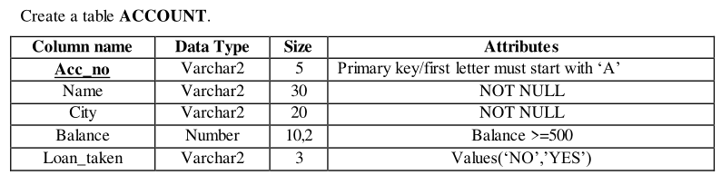
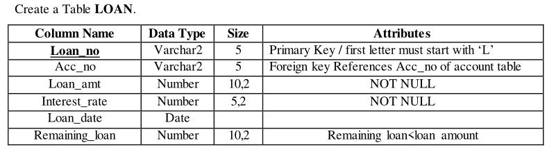
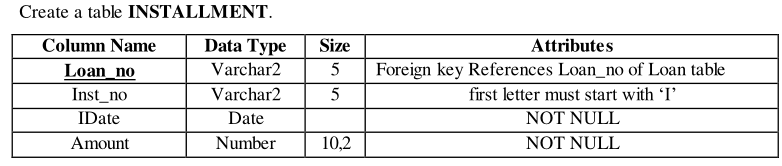
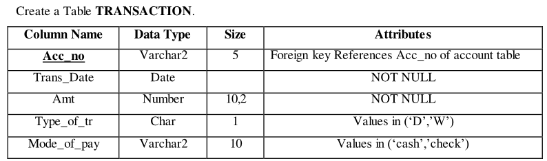

# Practical 3

## Create tables with given constraints.



```sql
create table account
(
    acc_no varchar2(5) primary key check (substr(acc_no, 1, 1) = 'A'),
    name varchar2(30) not null,
    city varchar2(20) not null,
    balance number (10,2) check (balance >= 500),
    loan_taken varchar2(5) check (loan_taken = 'NO' or loan_taken = 'YES')
)
```

**Insert the following records into table account**


**Solution**

```sql
insert into account (acc_no, name, city, balance, loan_taken) values ('A001', 'Patel Jigar', 'Mehsana', '50000', 'YES')
insert into account (acc_no, name, city, balance, loan_taken) values ('A002', 'Patel Ramesh', 'Mehsana', '50000', 'YES')
insert into account (acc_no, name, city, balance, loan_taken) values ('A003', 'Dave Hardik', 'Ahmedabad', '50000', 'NO')
insert into account (acc_no, name, city, balance, loan_taken) values ('A004', 'Soni Hetal', 'Ahmedabad', '50000', 'NO')
insert into account (acc_no, name, city, balance, loan_taken) values ('A005', 'Sony Atul', 'Vadodara', '50000', 'YES')
```




```sql
create table loan
(
    loan_no varchar2(5) primary key check (substr(loan_no, 1, 1) = 'L'),
    acc_no varchar2(5),
    loan_amt number(10,2) not null,
    interest_rate number(5,2) not null,
    loan_date date,
    remaining_loan number (20,2),
    foreign key (acc_no) references account(acc_no),
    constraint loan_check check (remaining_loan < loan_amt)
)
```

**Insert the following records into table loan**


**Solution**

```sql
insert into loan (loan_no, acc_no, loan_amt, interest_rate, loan_date, remaining_loan) values ('L001', 'A001', '100000', '7', '01-01-2004', '75000')
insert into loan (loan_no, acc_no, loan_amt, interest_rate, loan_date, remaining_loan) values ('L002', 'A002', '300000', '9', '05-18-2004', '150000')
insert into loan (loan_no, acc_no, loan_amt, interest_rate, loan_date, remaining_loan) values ('L003', 'A005', '500000', '1', '06-15-2004', '300000')
```



```
create table installment
(
	loan_no varchar2(5),
	inst_no varchar2(5) check (substr(inst_no, 1, 1) = 'I'),
    inst_date date not null,
    amount number (10,2) not null,
    foreign key (loan_no) references loan(loan_no)
)
```

**Insert the following records into table installment**


```sql
insert into installment (loan_no, inst_no, inst_date, amount) values ('L001', 'I001', '02-02-2004', '15000')
insert into installment (loan_no, inst_no, inst_date, amount) values ('L002', 'I002', '06-18-2004', '20000')
insert into installment (loan_no, inst_no, inst_date, amount) values ('L003', 'I003', '07-15-2004', '20000')
```



```sql
create table transaction
(
    acc_no varchar2(5),
    tr_date date not null,
    amt number(10,2) not null,
    type_of_tr char(1) check (type_of_tr = 'D' or type_of_tr = 'W'),
    mode_of_pay varchar2(10) check (mode_of_pay = 'Cash' or mode_of_pay = 'Cheque')
)
```

**Insert the following records into table transaction**


```sql
insert into transaction (acc_no, tr_date, amt, type_of_tr, mode_of_pay) values ('A001', '03-03-2004', '10000', 'D', 'Cash')
insert into transaction (acc_no, tr_date, amt, type_of_tr, mode_of_pay) values ('A002', '07-05-2004', '5000', 'W', 'Cheque')
insert into transaction (acc_no, tr_date, amt, type_of_tr, mode_of_pay) values ('A003', '08-12-2004', '25000', 'D', 'Cheque')
insert into transaction (acc_no, tr_date, amt, type_of_tr, mode_of_pay) values ('A004', '05-15-2004', '30000', 'D', 'Cheque')
insert into transaction (acc_no, tr_date, amt, type_of_tr, mode_of_pay) values ('A005', '10-22-2004', '15000', 'W', 'Cash')
```

## Queries Using Operator: NOT, BETWEEN, NOT BETWEEN, IN, NOT IN

1. Retrieve specified information for the account holder who are not in ‘Ahmedabad’.

```sql
select * from ACCOUNT where not city = 'Ahmedabad'
```

2. Retrieve specified information for the account holder who are not in ‘Ahmedabad’ or ‘Vadodara’.
```sql
select * from ACCOUNT where city not in('Ahmedabad','Vadodara')
```

3. Retrieve those records of Account holder whose balance between is 50000 and 100000.
```sql
select * from ACCOUNT where balance between 50000 and 100000
```
4. Retrieve those records of Account holder whose balance not between is 50000 and 100000.
```sql
select * from ACCOUNT where balance NOT between 50000 and 100000
```
5. Display only those records whose amount is 5000, 25000, 30000.
```sql
select * from INSTALLMENT where amount IN (5000,25000,30000)
```
6. Display only those records whose amount not in 5000, 25000, 30000.
```sql
select * from INSTALLMENT where amount NOT IN (5000,25000,30000)
```
7. Display System date.
```sql
select sysdate from dual
OR
select current_date from dual
```
8. Find the total transaction amount of account holder from transaction table.
```sql
select sum(amt) from transaction
```
9. Find minimum amount of transaction.
```sql
select min(amt) from transaction
```
10. Find maximum amount of transaction.
```sql
select max(amt) from transaction
```
11. Count the total account holders.
```sql
select count(acc_no) from account
```
12. Count only those records whose made of payment is ‘cash’.
```sql
select count(mode_of_pay) from transaction where mode_of_pay = 'Cash'
```
13. Count only those records whose transaction made in the month of ‘MAY’.
```sql
select count(acc_no) from transaction Where tr_date between '05-01-2004' and '05-31-2004'
```
14. Find the average value of transaction.
```sql
select avg(amt) from transaction
```
15. Display the result of 4 raise to 4.
```sql
select power(4,4) from dual
```
16. Find the square root of 25.
```sql
select sqrt(25) from dual
```
17. Write the query for the following Function.
18. LOWER,INITCAP,UPPER,SUBSTR,LENGTH,LTRIM
```sql
select LOWER('VARUN') from dual
select UPPER('varun') from dual
select SUBSTR('Varun',2,3) from dual
select LENGTH('Varun') from dual
select LTRIM('Varun','V') from dual

OR you can use any column of any table for these quries.
```
